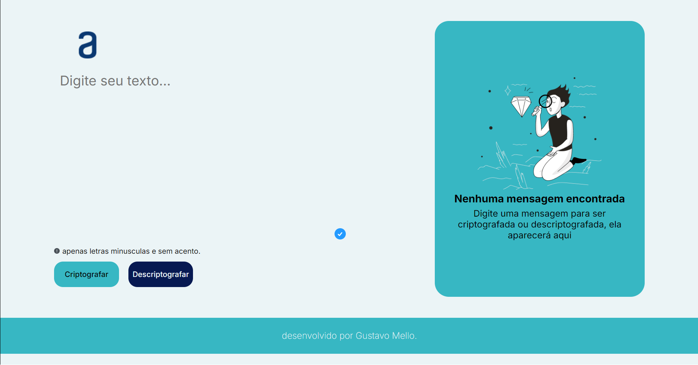
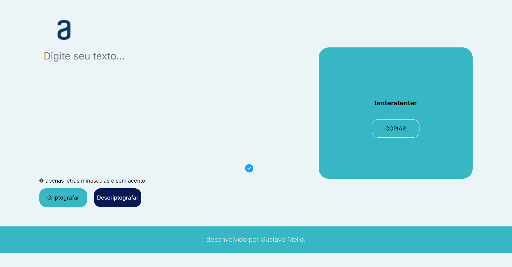
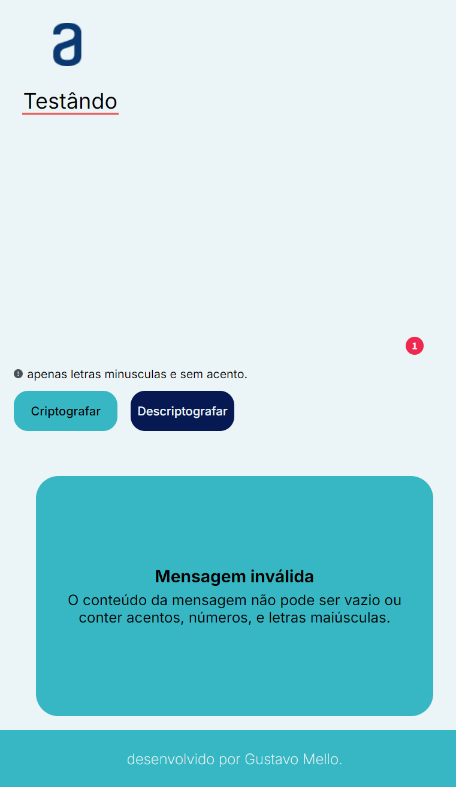
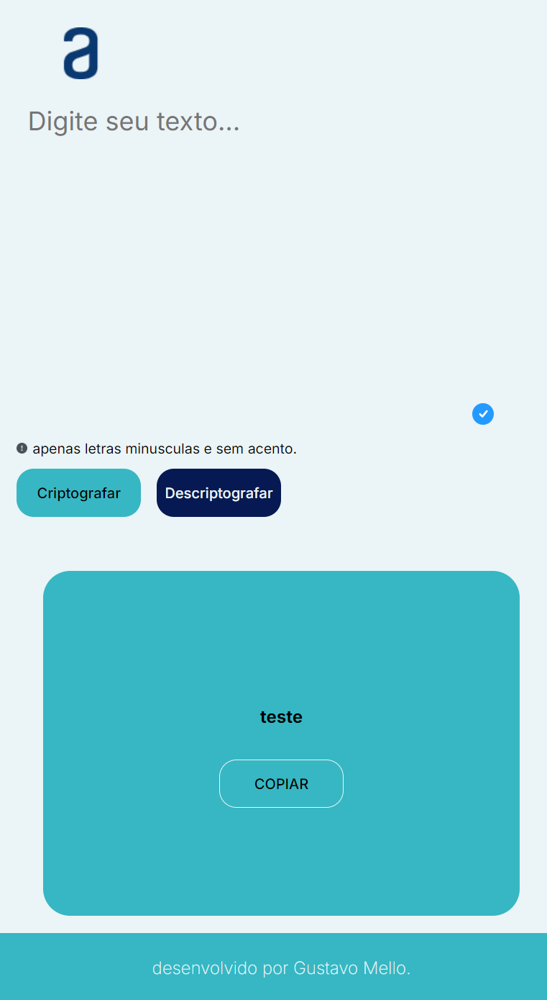

# Decodificador-de-Texto-ONE-Challenge 🚀👨🏽‍💻

Primeiro desafio do Programa ONE

---

## Resumo do Projeto 📝

O Desafio do Codificador consiste em programar uma página web que criptografe e descriptografe uma mensagem (entrada do usuário), seguindo uma chave de criptografia pré-programada. Embora eu esteja atualizando o README 5 dias depois de ter terminado a base do meu projeto, há algumas correções em andamento.

## Tecnologias utilizadas 🧰

- **Figma**: Protótipo base fornecido pela ONE, foi usado algumas imagens e paleta de cores disponibilizadas.
- **HTML + CSS**: Na construção da estrutura e estilização da página, o básico de toda web.
- **JavaScript**: Na lógica e interação da página.

## Screenshots 📷

### Desktop ⌨️

Página se inicia como mostrado na imagem.

Êxito na criptografia, mensagem é exibida no "painel" a direita (mensagem criptografada: "teste", retorno "tenterstenter").

### Mobile/Tablet 📱

Erro na criptografia, o aviso começa piscar (fade-in, fade-out em 1 segundo repetidamente) na cor vermelha, atentando o usuário a ler sobre a limitação da aplicação.

Êxito na descriptografia, botão de copiar aparece abaixo da mensagem.

---

## Desenvolvimento comentado do projeto 💬

- **[27/06/2024]**: Após apagar o antigo repositório (acabei achando que ficou bagunçado demais), refiz o projeto neste, oque explica o Decodificador ter (até o momento) 4/5 dias de desenvolvimento e já estar "completo", eu já havia tentado fazer desde dia [24/06]. Eu não sou um mau perdedor, senti que fiquei perdido na primeira tentativa, e resolvi apagar o projeto pra tentar de novo "mais tarde", iria rever alguns videos do curso, por mais que eu já tivesse terminado, eu tinha certeza de que faltou ver alguma coisa, e faltava mesmo, meus conhecimentos em CSS não são dos melhores - até por que eu resolvi focar em programação propriamente dita, ao que se diz respeito de desenvolvimento web, pode se dizer que eu só conheço "uma rasa parte da base" -. Consultei a ajuda de alguém (não sei se posso citar o indivíduo, depois consulto ele) no Discord da turma que eu tô (turma 7), enquanto eu programava, o cara ia me sugerindo mudanças e corrigindo erros, principalmente na parte que eu disse a pouco, a estilização. Mais tarde apareceu um outro "aluno" (se pode se chamar assim) que rapidamente me ajudou a construir um código JS mais conciso. Sou grato a ajuda dos dois, consegui "quase terminar" o projeto EM UM DIA, mas resolvi deixar pra finalizar conforme progredisse no curso, pois ainda falta terminar a parte da trilha sobre HTML e CSS (Pode ver no meu repositório de estudos). `~ Escrito em 02/07/2024` 🔺

- **[06/08/2024]**: Tive problemas com o trabalho, não imaginei que mesmo assim, seria tão fácil ou que eu estava perto de terminar de "adiquirir conhecimento" suficiente para fazer o projeto da maneira que imaginei. Estou feliz e muito satisfeito. 🔻

- # [Acessar](https://yo-melloo.github.io/Decodificador-de-Texto-ONE-Challenge/)
